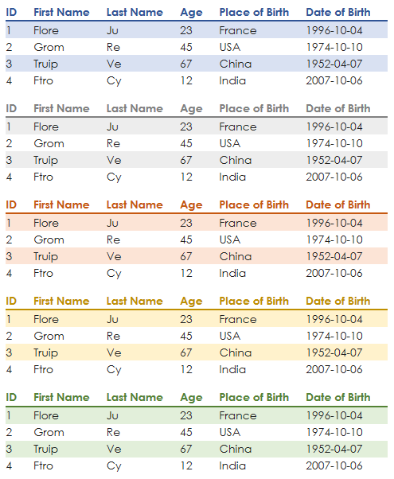
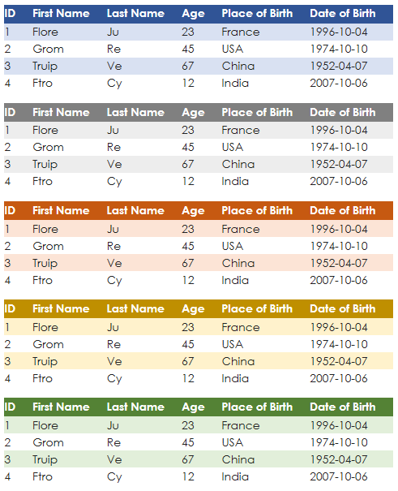

# pretty_html_table - Beautiful html tables made easy
Detailed usage documentation is still in progress
The objective of this package is to convert a pandas dataframe into a pretty html table.
As of now, 10 colors are available. This package is embedding very nicely with other packages used to send emails.
The format is set down to the line item, which allows it to be understood by every email providers (instead of using CSS style).

This is how you can install it on your machine:

```
pip install pretty_html_table
```

This is for example how you can convert your dataframe:

```
import pretty_html_table
html_table_blue_light = build_table(pd.read_excel('df.xlsx'), 'blue_light')
print(html_table_blue_light)
```

## Why choose pretty_html_table?
It integrates very well with other python packages used to send emails. Just add the result of this package to the body of the email and voila.


## List of colors available

| Name          | font style     | Header                                                        | Rows                                                              |
|---------------|----------------|---------------------------------------------------------------|-------------------------------------------------------------------|
| 'blue_light'  | Century Gothic | Bold: yes / Background color: white / Font color: dark blue   | Odd background color: light blue / Even background color: white   |
| blue_dark'    | Century Gothic | Bold: yes / Background color: dark blue / Font color: white   | Odd background color: light blue / Even background color: white   |
| grey_light'   | Century Gothic | Bold: yes / Background color: white / Font color: dark grey   | Odd background color: light grey / Even background color: white   |
| grey_dark'    | Century Gothic | Bold: yes / Background color: dark grey / Font color: white   | Odd background color: light grey / Even background color: white   |
| orange_light' | Century Gothic | Bold: yes / Background color: white / Font color: dark orange | Odd background color: light orange / Even background color: white |
| orange_dark'  | Century Gothic | Bold: yes / Background color: dark orange / Font color: white | Odd background color: light orange / Even background color: white |
| yellow_light' | Century Gothic | Bold: yes / Background color: white / Font color: dark yellow | Odd background color: light yellow / Even background color: white |
| yellow_dark'  | Century Gothic | Bold: yes / Background color: dark yellow / Font color: white | Odd background color: light yellow / Even background color: white |
| green_light'  | Century Gothic | Bold: yes / Background color: white / Font color: dark green  | Odd background color: light green / Even background color: white  |
| green_dark'   | Century Gothic | Bold: yes / Background color: dark green / Font color: white  | Odd background color: light green / Even background color: white  |


## Example of an integration with the O365 package
[O365](https://pypi.org/project/O365/)

First, we create a function to send an email:

```
import O365
from O365 import Account

credentials = (o365credid, o365credpwd)
account = Account(credentials)

def send_email(account, to, subject, start, body, end):
    m = account.new_message()
    m.to.add(to)
    m.subject = subject
    m.body = start + body + end
    m.send()
```

Then we can write the start of an email and the end of the email using the html language:

```
start = """<html>
                <body>
                    <strong>There should be an table here:</strong></br>"""


end = """</body>
    </html>
    """
```

Finally we can can pretty_table_html package and send the email:

```
import ph_table

html_table_blue_light = build_table(pd.read_excel('df.xlsx'), 'blue_light')

send_email(account
           , 'test@any.com'
           , 'test table'
           , start
           , html_table_blue_light
           , end)
```

Here are all of the currently available colors:


